<p align="center">
  <h1 align="center">🛡️🔥 SentinelForge</h1>
  <p align="center">
    <em>Forge Your Defense with Threat Intelligence</em>
  </p>
</p>

<p align="center">
  
  
  
  
</p>

---

## 📖 Overview

**SentinelForge** collects Indicators of Compromise (IOCs) from multiple sources, enriches them with contextual data, and provides a unified API for threat intelligence lookups. It's your forge for crafting actionable security intelligence.

## 🏗️ Architecture

```mermaid
flowchart TB
    subgraph Sources
        HT[🍯 HoneyTrap]
        OTX[🛸 AlienVault OTX]
        ET[⚡ Emerging Threats]
        FT[🏦 Feodo Tracker]
        MAN[✍️ Manual Input]
    end

    subgraph SentinelForge
        COL[📥 Collectors]
        NORM[🔧 Normalizer]
        ENR[✨ Enrichment Engine]
        STORE[(🗄️ PostgreSQL)]
        CACHE[(⚡ Redis)]
        API[🌐 REST API]
    end

    subgraph Enrichment Providers
        GEO[🌍 GeoIP]
        DNS[📡 DNS]
        WHOIS[📋 WHOIS]
        ABUSE[🚫 AbuseIPDB]
        VT[🦠 VirusTotal]
    end

    HT --> COL
    OTX --> COL
    ET --> COL
    FT --> COL
    MAN --> API

    COL --> NORM
    NORM --> STORE
    NORM --> ENR

    ENR --> GEO
    ENR --> DNS
    ENR --> WHOIS
    ENR --> ABUSE
    ENR --> VT

    GEO --> STORE
    DNS --> STORE
    WHOIS --> STORE
    ABUSE --> STORE
    VT --> STORE

    STORE --> API
    CACHE --> API
```



## 🚀 Quick Start

### Prerequisites

- Docker & Docker Compose
- (Optional) Rust 1.70+ for local development

### Run with Docker

```bash
# Clone the repository
git clone https://github.com/lloredia/sentinelforge.git
cd sentinelforge

# Start services
docker-compose up -d

# Check health
curl http://localhost:8080/health
```

### API Usage

```bash
# Add an indicator
curl -X POST http://localhost:8080/api/v1/indicators \
  -H "Content-Type: application/json" \
  -d '{"value": "192.168.1.100", "tags": ["suspicious"]}'

# Lookup an indicator
curl http://localhost:8080/api/v1/lookup/192.168.1.100

# List indicators
curl http://localhost:8080/api/v1/indicators

# Get statistics
curl http://localhost:8080/api/v1/stats
```

## 📊 IOC Types Supported

| Type | Examples | Auto-Detection |
|------|----------|----------------|
| IP | `192.168.1.1`, `2001:db8::1` | ✅ |
| Domain | `malware.com`, `evil.example.org` | ✅ |
| URL | `https://malware.com/payload.exe` | ✅ |
| Hash | MD5, SHA1, SHA256, SHA512 | ✅ |
| Email | `attacker@evil.com` | ✅ |
| CVE | `CVE-2021-44228` | ✅ |

## ✨ Enrichment Providers

| Provider | Data | API Key Required |
|----------|------|------------------|
| MaxMind GeoIP | Country, City, ASN, ISP | ❌ (database file) |
| DNS | A, AAAA, MX, TXT, NS, PTR records | ❌ |
| WHOIS | Registrar, registrant, dates | ❌ |
| AbuseIPDB | Abuse score, reports, ISP | ✅ |
| VirusTotal | Detection ratio, reputation | ✅ |

## 🔗 Integration with HoneyTrap

Import IOCs captured by your HoneyTrap honeypot:

```bash
# From events file
curl -X POST http://localhost:8080/api/v1/indicators/bulk \
  -H "Content-Type: application/json" \
  -d @- << EOF
{
  "source": "honeytrap",
  "indicators": [
    {"value": "attacker-ip-1"},
    {"value": "attacker-ip-2"}
  ]
}
EOF
```

## ⚙️ Configuration

| Environment Variable | Default | Description |
|---------------------|---------|-------------|
| `HOST` | `0.0.0.0` | Server bind address |
| `PORT` | `8080` | Server port |
| `DATABASE_URL` | - | PostgreSQL connection string |
| `GEOIP_CITY_DB` | - | Path to GeoLite2-City.mmdb |
| `GEOIP_ASN_DB` | - | Path to GeoLite2-ASN.mmdb |
| `ABUSEIPDB_API_KEY` | - | AbuseIPDB API key |
| `VIRUSTOTAL_API_KEY` | - | VirusTotal API key |
| `RUST_LOG` | `info` | Log level |

## 📡 API Endpoints

| Method | Endpoint | Description |
|--------|----------|-------------|
| GET | `/health` | Health check |
| GET | `/api/v1/indicators` | List indicators (with filters) |
| POST | `/api/v1/indicators` | Create indicator |
| POST | `/api/v1/indicators/bulk` | Bulk import |
| GET | `/api/v1/indicators/:id` | Get indicator details |
| POST | `/api/v1/indicators/:id/enrich` | Trigger enrichment |
| POST | `/api/v1/indicators/:id/sightings` | Record sighting |
| GET | `/api/v1/lookup?value=` | Lookup by value |
| GET | `/api/v1/stats` | Dashboard statistics |
| GET | `/api/v1/sources` | List feed sources |

## 🗺️ Roadmap

- [x] Core IOC storage
- [x] Auto type detection
- [x] GeoIP enrichment
- [x] DNS enrichment
- [x] AbuseIPDB integration
- [x] VirusTotal integration
- [x] HoneyTrap integration
- [ ] AlienVault OTX feeds
- [ ] MISP integration
- [ ] Scheduled feed updates
- [ ] React dashboard
- [ ] STIX/TAXII export
- [ ] Threat scoring ML

## 📄 License

MIT License - see [LICENSE](LICENSE)

---

<p align="center">
  Part of the <strong>SecOps Command Center</strong> 🛡️
  <br>
  <em>Forge your defense. Stay vigilant.</em>
</p>
